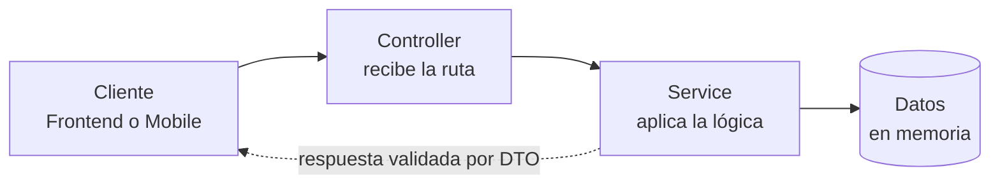
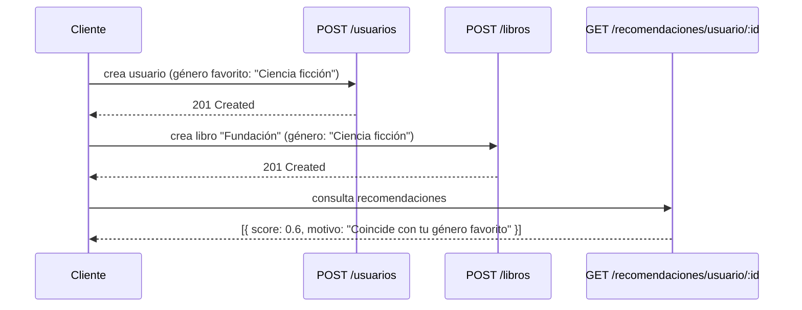

# Arquitectura General de la API

Cómo viaja una petición desde el cliente hasta la respuesta.

## Analogía: un restaurante

Para entender los cuatro conceptos clave, piensa en un restaurante:

| Pieza | Analogía | Qué hace |
|---|---|---|
| **Controller** | El mesero | Define las rutas HTTP (`/libros`, `/usuarios`) y qué método (GET, POST, PATCH, DELETE) dispara qué acción. No contiene lógica de negocio, solo recibe y delega. |
| **Service** | El cocinero | Contiene la lógica real: crear, validar reglas, calcular. Es la capa que en hitos siguientes hablará con la base de datos real. |
| **DTO** | La comanda | Define exactamente qué datos deben entrar o salir de un endpoint, con validaciones automáticas (`class-validator`). Si falta un campo obligatorio o sobra uno no declarado, la API responde `400`. |
| **Module** | La puerta del departamento | Conecta Controller y Service para que NestJS sepa que existen. Cada dominio de negocio (usuarios, libros, etc.) tiene el suyo. |

## Configuración transversal

Dos archivos concentran todo lo que aplica a la API completa:

- **`app.module.ts`** — importa los 7 módulos de dominio.
- **`main.ts`** — configura:
  - `ValidationPipe` global (`whitelist`, `forbidNonWhitelisted`, `transform`)
  - CORS habilitado
  - Documentación Swagger (ver [Documentación OpenAPI / Swagger](Documentacion-OpenAPI-Swagger))

## Ejemplo real de flujo completo

Este flujo fue probado de punta a punta sobre el proyecto:

Este ejemplo conecta 3 módulos distintos (`usuarios`, `libros`, `recomendaciones`) y demuestra que el motor de recomendaciones —uno de los ejes de esfuerzo diferencial del proyecto— ya funciona sobre datos reales creados a través de la propia API, no sobre datos hardcodeados. El campo `motivo` existe a propósito: hace el resultado explicable, no una caja negra.

---
Ver también: [Organización del Proyecto](Organizacion-del-Proyecto) · [Decisiones Técnicas](Decisiones-Tecnicas)
