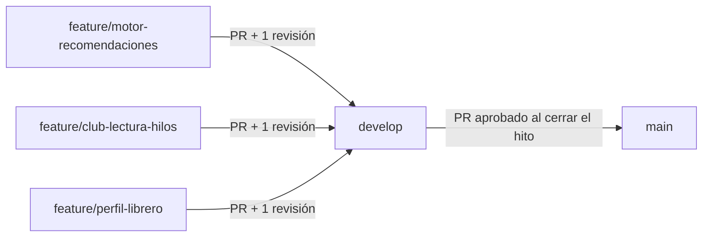

# Flujo de Ramas y Contribución

Estrategia de ramas y reglas de commits/PRs para el desarrollo colaborativo del equipo Backend.

## Estrategia de ramas



| Rama | Propósito | Quién puede hacer push directo |
|---|---|---|
| `main` | Código entregado y estable de cada hito | Nadie — solo vía PR aprobado |
| `develop` | Integración de features antes de pasar a `main` | Nadie — solo vía PR |
| `feature/<nombre-corto>` | Una rama por funcionalidad o servicio | El integrante que la creó |

**Regla clave:** nunca se trabaja directo sobre `main` ni `develop`. Toda funcionalidad nace en una rama `feature/*` a partir de `develop`.

```bash
git checkout develop
git pull origin develop
git checkout -b feature/motor-recomendaciones
```

## Convención de commits

Se usa el formato [Conventional Commits](https://www.conventionalcommits.org/):

```
<tipo>(<módulo opcional>): <descripción breve en minúsculas>
```

| Tipo | Uso |
|---|---|
| `feat` | Nueva funcionalidad |
| `fix` | Corrección de un bug |
| `docs` | Cambios solo de documentación |
| `refactor` | Cambio de código que no agrega funcionalidad ni corrige bugs |
| `test` | Agregar o corregir tests |
| `chore` | Tareas de configuración, dependencias, etc. |

Ejemplos:
```
feat(recomendaciones): agregar endpoint GET /recomendaciones/usuario/:id
fix(libros): corregir validación de ISBN vacío
docs: actualizar README con instrucciones de instalación
```

## Reglas para Pull Requests

1. Todo PR apunta a `develop` (nunca directo a `main`).
2. Título del PR en el mismo formato que los commits: `feat(club-lectura): hilos de discusión`.
3. Descripción mínima: qué se hizo, cómo probarlo, y qué endpoints quedaron disponibles.
4. Se requiere **al menos 1 revisión aprobada** antes de mergear.
5. El PR debe pasar `npm run build` y `npm run test:e2e` sin errores antes de solicitar revisión.
6. Usar **Squash and merge** al integrar a `develop`, para mantener el historial limpio.
7. Al cerrar un hito, se abre un PR de `develop` → `main`, y se etiqueta el commit resultante con el tag del hito.

## Checklist antes de abrir un PR

- [ ] El código compila (`npm run build`)
- [ ] Los tests e2e existentes siguen pasando (`npm run test:e2e`)
- [ ] Los nuevos endpoints están documentados con `@ApiTags` / `@ApiOperation`
- [ ] Los DTOs nuevos tienen decoradores de `class-validator`
- [ ] Se actualizó [Servicios Identificados](Servicios-Identificados) si se agregó/cambió un servicio

## Publicar y taguear una entrega

```bash
# Etiquetar la versión de un hito
git tag -a hito-1 -m "Entrega Hito 1 - Backend LeeConNos"
git push origin hito-1

# Obtener el hash del commit para la presentación
git rev-parse hito-1
```

---
Ver también: [Cómo Ejecutar el Proyecto](Como-Ejecutar-el-Proyecto) · [Decisiones Técnicas](Decisiones-Tecnicas)
