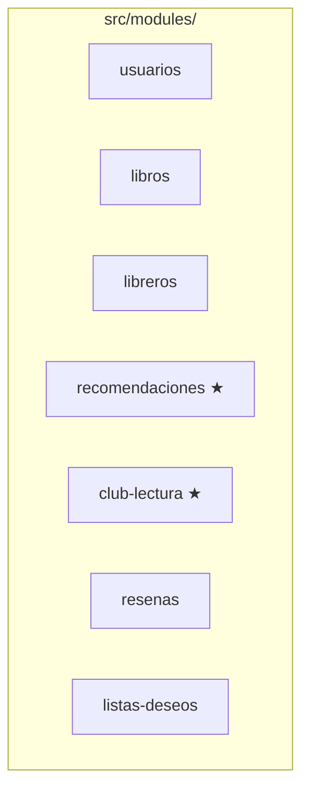

# Organización del Proyecto

El proyecto está estructurado **por módulo de dominio funcional**, no por capa técnica, siguiendo las bases del Hito 1.



★ = eje de esfuerzo diferencial del proyecto.

## Qué archivos trae cada módulo

```
src/modules/<dominio>/
├── <dominio>.module.ts      → conecta controller + service
├── <dominio>.controller.ts  → define las rutas HTTP (el "mesero")
├── <dominio>.service.ts     → lógica de negocio (el "cocinero")
├── dto/                      → forma validada de entrada/salida
│   ├── create-*.dto.ts
│   └── update-*.dto.ts
└── entities/                 → forma del objeto (ej. Usuario, Libro)
```

## Árbol completo del repositorio

```
leeconnos-backend/
├── src/
│   ├── main.ts               # Bootstrap: Swagger, ValidationPipe, CORS
│   ├── app.module.ts         # Importa los 7 módulos de dominio
│   └── modules/
│       ├── usuarios/
│       ├── libros/
│       ├── libreros/
│       ├── recomendaciones/
│       ├── club-lectura/
│       ├── resenas/
│       └── listas-deseos/
├── test/
│   └── app.e2e-spec.ts       # Tests end-to-end
├── docs/
│   └── servicios-identificados.md
├── .env.example
├── CONTRIBUTING.md
└── README.md
```

## Convención de nombres

| Elemento | Convención | Ejemplo |
|---|---|---|
| Carpeta de módulo | kebab-case | `club-lectura` |
| Clase de servicio | PascalCase + Service | `ClubLecturaService` |
| Clase de controller | PascalCase + Controller | `ClubLecturaController` |
| DTO de creación | Create + Entidad + Dto | `CreateClubLecturaDto` |
| DTO de actualización | Update + Entidad + Dto | `UpdateClubLecturaDto` |
| Entidad | PascalCase singular | `ClubLectura` |

---
Ver también: [Arquitectura General](Arquitectura-General) · [Cómo Ejecutar el Proyecto](Como-Ejecutar-el-Proyecto)
